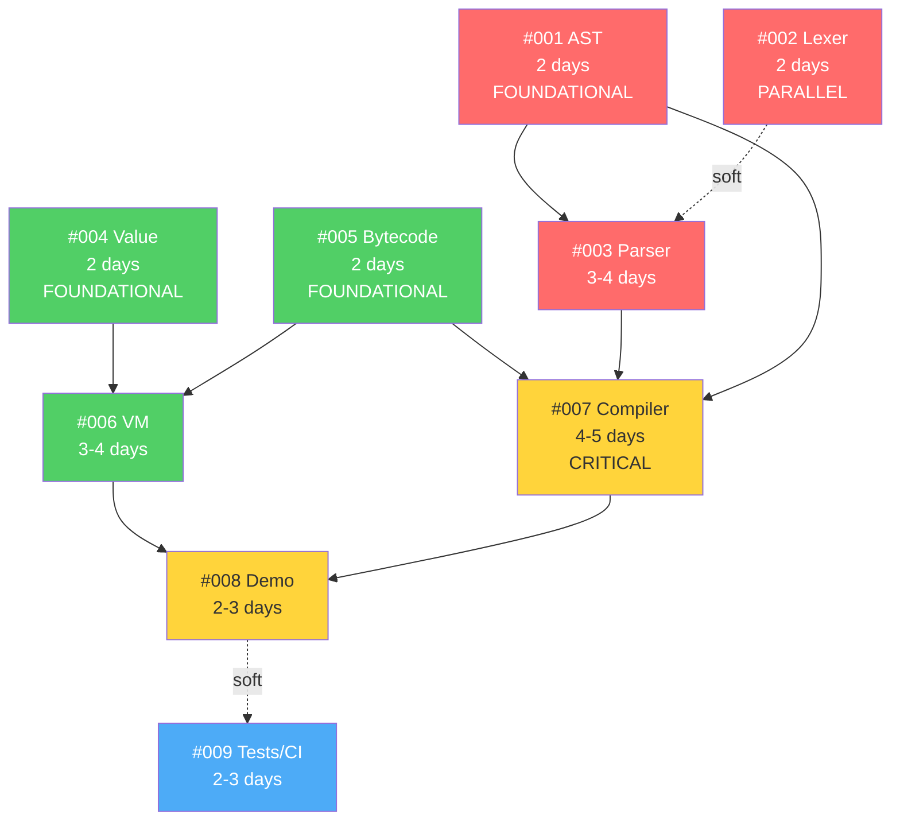
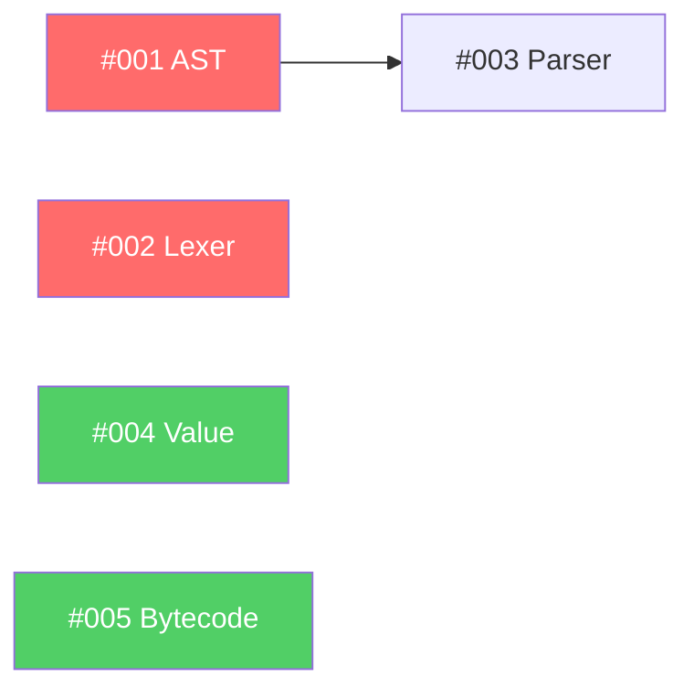
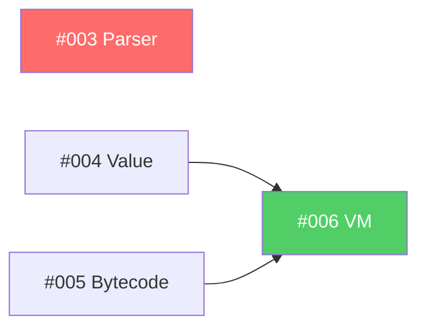
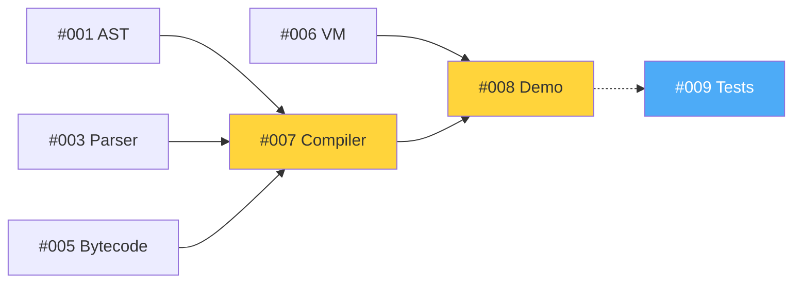

# FSRS Phase 1 Dependency Graph

Visual representation of issue dependencies and critical path for Phase 1 MVP.

## Dependency Matrix

| Issue | Depends On | Blocks | Parallel Safe |
|-------|-----------|---------|---------------|
| #001 Core AST | None | #003, #007 | ✅ Yes |
| #002 Lexer | None | #003 (soft) | ✅ Yes |
| #003 Parser | #001 (hard), #002 (soft) | #007 | ⚠️ Needs #001 |
| #004 Value | None | #006 | ✅ Yes |
| #005 Bytecode | None | #006, #007 | ✅ Yes |
| #006 VM | #004, #005 | #008 | ⚠️ Needs #004, #005 |
| #007 Compiler | #001, #003, #005 | #008 | ❌ Needs 3 issues |
| #008 Demo | #003, #006, #007 | #009 (soft) | ❌ Needs 3 issues |
| #009 Tests/CI | #008 (soft) | None | ⚠️ Benefits from #008 |

## Dependency Graph



**Legend**:
- 🔴 Red: Frontend (AST, Lexer, Parser)
- 🟢 Green: VM (Value, Bytecode, Interpreter)
- 🟡 Yellow: Integration (Compiler, Demo)
- 🔵 Blue: Testing (CI/CD)
- Solid arrows: Hard dependencies
- Dashed arrows: Soft dependencies

## Critical Path Analysis

### Critical Path (Longest Sequence)

```
#001 (2d) → #003 (4d) → #007 (5d) → #008 (3d) = 14 days
```

**This is the minimum time to complete Phase 1** even with infinite developers.

### Parallel Paths

**Path 1 (Frontend)**:
```
#001 (2d) → #003 (4d) → #007 (5d) = 11 days
```

**Path 2 (VM)**:
```
#004 (2d) → #005 (2d) → #006 (4d) = 8 days
```

**Path 3 (Support)**:
```
#002 (2d) + Reviews + Prep = 3-5 days
```

### Bottleneck Analysis

**Bottleneck**: #007 (Bytecode Compiler)
- Depends on 3 issues: #001, #003, #005
- Takes 4-5 days
- Blocks #008 (Demo)
- **Cannot be parallelized**

**Mitigation**:
- Prioritize completing #001, #003, #005 early
- Assign most experienced developer to #007
- Prepare interfaces/mocks early to enable parallel work

## Milestone Dependencies

### Milestone 1.1: Frontend Foundation (Week 1)
**Goal**: AST + Lexer + Parser complete

Dependencies:
- #001 ✅ None - Start immediately
- #002 ✅ None - Can parallel with #001
- #003 ⚠️ Needs #001

**Completion Criteria**:
- Can parse F# expressions into AST
- All frontend unit tests pass

---

### Milestone 1.2: VM Foundation (Week 2)
**Goal**: VM can execute bytecode

Dependencies:
- #004 ✅ None - Can parallel with frontend
- #005 ✅ None - Can parallel with frontend
- #006 ⚠️ Needs #004 + #005

**Completion Criteria**:
- Can execute simple bytecode chunks
- All VM unit tests pass

---

### Milestone 1.3: Integration (Week 3)
**Goal**: End-to-end pipeline working

Dependencies:
- #007 ❌ Needs #001, #003, #005 - **CRITICAL**
- #008 ❌ Needs #003, #006, #007
- #009 ⚠️ Soft dependency on #008

**Completion Criteria**:
- Can run .fsrs scripts end-to-end
- Demo works with example scripts
- CI pipeline green

## Work Order Recommendations

### Optimal Start Order (3 Developers)

**Day 1** (All hands):
1. **Dev 1**: Start #001 (AST) - PRIORITY
2. **Dev 2**: Start #004 (Value) - PRIORITY
3. **Dev 3**: Setup, docs, test infrastructure

**Day 2** (Continuing):
1. **Dev 1**: Finish #001, start #003 (Parser)
2. **Dev 2**: Finish #004, start #005 (Bytecode)
3. **Dev 3**: Start #002 (Lexer)

**Day 3-5** (Parallel tracks):
1. **Dev 1**: Continue #003 (Parser)
2. **Dev 2**: Finish #005, start #006 (VM)
3. **Dev 3**: Finish #002, review & docs

**Week 2** (Finishing foundations):
1. **Dev 1**: Finish #003, prepare for #007
2. **Dev 2**: Continue #006 (VM)
3. **Dev 3**: Example scripts, test prep

**Week 3** (Integration):
1. **Dev 1**: #007 (Compiler) - **CRITICAL**
2. **Dev 2**: #008 (Demo) - Parallel where possible
3. **Dev 3**: #009 (Tests/CI) - Parallel with #008

## Dependency Resolution Checklist

### Before Starting Each Issue

**#001 (AST)**:
- [ ] No dependencies - Can start immediately

**#002 (Lexer)**:
- [ ] No dependencies - Can start immediately

**#003 (Parser)**:
- [ ] #001 (AST) merged to main
- [ ] Can review AST types in `fsrs-frontend/src/ast.rs`

**#004 (Value)**:
- [ ] No dependencies - Can start immediately

**#005 (Bytecode)**:
- [ ] No dependencies - Can start immediately

**#006 (VM)**:
- [ ] #004 (Value) merged to main
- [ ] #005 (Bytecode) merged to main
- [ ] Can import types from `fsrs-vm/src/{value.rs,bytecode.rs}`

**#007 (Compiler)**:
- [ ] #001 (AST) merged to main
- [ ] #003 (Parser) merged to main
- [ ] #005 (Bytecode) merged to main
- [ ] Can import from all three modules

**#008 (Demo)**:
- [ ] #003 (Parser) merged to main
- [ ] #006 (VM) merged to main
- [ ] #007 (Compiler) merged to main
- [ ] End-to-end imports work

**#009 (Tests/CI)**:
- [ ] (Optional) #008 (Demo) merged for integration tests
- [ ] All crates build successfully

## Unblocking Strategies

### If #001 (AST) is Delayed
**Impact**: Blocks #003 (Parser) and #007 (Compiler)

**Mitigation**:
1. Define AST types interface early (even empty implementations)
2. Dev 1 focuses solely on #001 - highest priority
3. Other devs work on VM track (#004, #005)
4. Use mock AST types in Parser if needed

---

### If #003 (Parser) is Delayed
**Impact**: Blocks #007 (Compiler) and #008 (Demo)

**Mitigation**:
1. Implement parser incrementally (expressions first, then statements)
2. #007 can start with simple expressions while #003 finishes
3. Parallel: VM track continues (#006)

---

### If #007 (Compiler) is Delayed
**Impact**: Blocks #008 (Demo) - **CRITICAL**

**Mitigation**:
1. **All hands on deck** - pair programming
2. Implement simple expressions first, defer complex features
3. #008 can work with stub compiler initially
4. Daily check-ins on progress

---

### If #006 (VM) is Delayed
**Impact**: Blocks #008 (Demo)

**Mitigation**:
1. Implement minimal VM first (just arithmetic)
2. #008 can mock VM calls initially
3. Extend VM functionality incrementally

## Dependency Graph by Week

### Week 1 Dependencies



**Blocking Issues**: #001 (for #003)
**Parallel Issues**: #002, #004, #005

---

### Week 2 Dependencies



**Blocking Issues**: #004 + #005 (for #006)
**Parallel Issues**: #003, #006 (if deps met)

---

### Week 3 Dependencies



**Blocking Issues**: #007 (for #008)
**Parallel Issues**: #009 (can start with existing code)

---

**Total Issues**: 9
**Critical Path**: 14 days
**Parallel Speedup**: 3x (with 3 developers)
**Minimum Duration**: 3 weeks