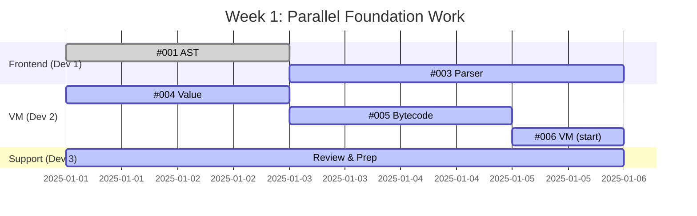
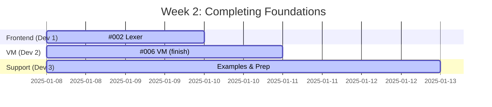
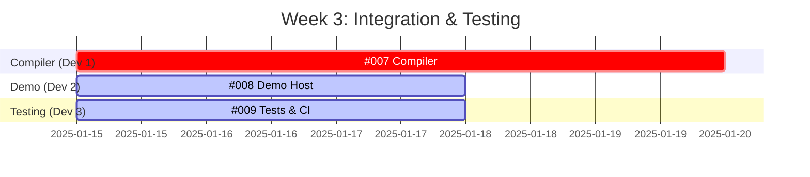

# FSRS Phase 1 Parallelization Guide

Guide for maximizing parallel development throughput during Phase 1 MVP implementation.

## Overview

Out of 9 total issues, **6 can be worked on in parallel** in Week 1-2. This enables a 3-developer team to complete Phase 1 in 3 weeks instead of 9+ weeks sequential development.

## Parallel Work Philosophy

### ✅ Safe to Parallelize When:
- Issues modify different crates (`fsrs-frontend` vs `fsrs-vm`)
- Issues work on different modules within a crate
- Issues have no direct dependencies
- Issues have explicit `parallel-safe` label

### ❌ NOT Safe to Parallelize When:
- Issues modify same files
- Issues depend on each other's outputs
- One issue blocks another

## Team Structure (3 Developers)

### Developer 1: Frontend Specialist
**Focus**: Parser, AST, Compiler

**Week 1**:
- Days 1-2: #001 (Core AST) - FOUNDATIONAL
- Days 3-5: #003 (Parser) - Uses AST

**Week 2**:
- Days 1-2: #002 (Lexer) - Can overlap with Week 1

**Week 3**:
- Days 1-5: #007 (Bytecode Compiler) - CRITICAL PATH

**Skills**: F# syntax, parser design, AST transformations

---

### Developer 2: VM Specialist
**Focus**: Runtime, Bytecode, Execution

**Week 1-2**:
- Days 1-2: #004 (Value Representation) - FOUNDATIONAL
- Days 3-4: #005 (Bytecode Instructions) - FOUNDATIONAL
- Days 5-10: #006 (VM Interpreter) - CRITICAL

**Week 3**:
- Days 1-3: #008 (Demo Host Integration)

**Skills**: VM design, bytecode execution, performance

---

### Developer 3: Integration & Quality
**Focus**: Testing, CI/CD, Documentation, Support

**Week 1**:
- Support: Review #001 (AST), pair on design decisions
- Prep: Set up test infrastructure, write docs

**Week 2**:
- Support: Review #004-#006 (VM components)
- Prep: Create example .fsrs scripts

**Week 3**:
- Days 1-3: #009 (Test Suite & CI) - Can parallel with #008
- Integration testing and bug fixes

**Skills**: Testing, CI/CD, technical writing, debugging

## Week-by-Week Breakdown

### Week 1: Frontend + VM Foundations (PARALLEL)



**Parallel Tracks**:
- **Track A (Frontend)**: #001 → #003
- **Track B (VM)**: #004 → #005 → #006 (start)
- **Track C (Support)**: Reviews, docs, test prep

**File Conflicts**: NONE
- Dev 1: `fsrs-frontend/src/{ast.rs, parser.rs}`
- Dev 2: `fsrs-vm/src/{value.rs, bytecode.rs, vm.rs}`
- Dev 3: `docs/`, test stubs

**Dependencies Met**:
- #003 needs #001 (AST types) - Sequential on Dev 1
- #006 needs #004 + #005 - Sequential on Dev 2

---

### Week 2: Complete Foundations + Start Lexer



**Parallel Tracks**:
- **Track A**: #002 (Lexer) - Independent
- **Track B**: #006 (VM) - Finishing up
- **Track C**: Example scripts, test scaffolding

**File Conflicts**: NONE

---

### Week 3: Integration (SEQUENTIAL)



**Sequential/Parallel**:
- #007 (Compiler) - **CRITICAL PATH** - Must complete first 3 days
- #008 (Demo) can start Day 1 with stubs, finalize after #007
- #009 (Tests) can parallel with #008

**File Conflicts**: MINIMAL
- #007: `fsrs-frontend/src/compiler.rs`
- #008: `fsrs-demo/src/main.rs`
- #009: `tests/`, `.github/workflows/`

---

## Parallelization Matrix

| Week | Parallel Issues | Team Utilization |
|------|----------------|------------------|
| Week 1 | #001, #004, #005 (3 issues) | 100% (all devs busy) |
| Week 2 | #002, #003, #006 (3 issues) | 100% (all devs busy) |
| Week 3 | #007, #008, #009 (3 issues) | 100% (all devs busy) |

**Total Duration**: 3 weeks with parallelization
**Sequential Duration**: 9+ weeks
**Speedup**: 3x faster

## Merge Conflict Prevention

### Directory-Based Ownership

| Developer | Owned Directories | Files |
|-----------|------------------|-------|
| Frontend Dev | `fsrs-frontend/src/` | `ast.rs`, `lexer.rs`, `parser.rs`, `compiler.rs` |
| VM Dev | `fsrs-vm/src/` | `value.rs`, `bytecode.rs`, `vm.rs` |
| Integration Dev | `fsrs-demo/src/`, `tests/`, `.github/` | `main.rs`, integration tests, CI config |

### Shared Files Protocol

**Potentially Shared Files**:
- `fsrs-frontend/src/lib.rs` - Module exports
- `fsrs-vm/src/lib.rs` - Module exports
- `rust/Cargo.toml` - Workspace config

**Protocol**:
1. First developer to need the file creates minimal structure
2. Add module declarations incrementally
3. Communicate via PR comments before making changes
4. Small, focused commits

### Git Branch Strategy

```
main
├─ feat/issue-001-core-ast
├─ feat/issue-002-lexer
├─ feat/issue-003-parser
├─ feat/issue-004-value
├─ feat/issue-005-bytecode
├─ feat/issue-006-vm
├─ feat/issue-007-compiler
├─ feat/issue-008-demo
└─ feat/issue-009-tests-ci
```

**Merge Strategy**:
1. Feature branches merge directly to `main`
2. Squash merge to keep history clean
3. Rebase before merging to stay current
4. Delete branch after merge

### Daily Sync Protocol

**Morning Standup** (15 min):
- What you completed yesterday
- What you're working on today
- Any blockers or dependencies
- Which files you'll be touching

**End-of-Day**:
- Push WIP commits
- Update PR status
- Flag any upcoming conflicts

## TDD Workflow for Each Issue

### Test-Driven Development Process

1. **Red**: Write failing test first
   ```rust
   #[test]
   fn test_parse_let_binding() {
       let expr = parse_expr("let x = 10 in x");
       assert!(matches!(expr, Expr::Let { .. }));
   }
   ```

2. **Green**: Implement minimum code to pass
   ```rust
   fn parse_let(&mut self) -> Result<Expr, ParseError> {
       // Minimal implementation
   }
   ```

3. **Refactor**: Clean up, improve, optimize
   ```rust
   fn parse_let(&mut self) -> Result<Expr, ParseError> {
       // Refactored, cleaner implementation
   }
   ```

4. **Repeat** for next feature

### PR Checklist

Before opening PR:
- [ ] All tests pass: `just test`
- [ ] No clippy warnings: `just lint`
- [ ] Code formatted: `just fmt`
- [ ] New tests added for new functionality
- [ ] Documentation updated
- [ ] Rebase on main (no conflicts)

## Communication Channels

### Recommended Setup

**GitHub**:
- Issues: Task tracking
- PRs: Code review
- Discussions: Design decisions

**Slack/Discord** (if available):
- `#fsrs-general` - General discussion
- `#fsrs-frontend` - Parser/compiler work
- `#fsrs-vm` - VM runtime work
- `#fsrs-standup` - Daily updates

### PR Review Protocol

**Priority Levels**:
1. **Critical** (#001, #004) - Review within 4 hours
2. **High** (#003, #006, #007) - Review within 8 hours
3. **Normal** - Review within 24 hours

**Reviewer Assignment**:
- Frontend PRs: VM dev + Integration dev
- VM PRs: Frontend dev + Integration dev
- Integration PRs: All team members

## Success Metrics

### Parallelization Efficiency

```
Efficiency = (Actual Duration) / (Sequential Duration)
Target: < 40%
```

**Phase 1 Target**:
- Sequential: 9+ weeks
- Parallel (3 devs): 3 weeks
- Efficiency: 33% ✅

### Merge Conflict Rate

```
Conflict Rate = (PRs with conflicts) / (Total PRs)
Target: < 5%
```

**Expected**:
- 9 PRs total
- 0-1 conflicts expected (shared lib.rs files)
- Rate: < 11% ✅

### Code Review Latency

```
Review Latency = Time from "ready for review" to first review
Target: < 12 hours
```

## Risk Mitigation

### Risk: Dependency Delays

**Symptoms**:
- Dev 1 waiting on #001 before starting #003
- Dev 2 waiting on #004 + #005 before finishing #006

**Prevention**:
- Start with foundational issues (#001, #004)
- Use mocks/stubs to unblock downstream work
- Parallel work on independent features

**Response**:
- Pair programming on blockers
- Escalate to team lead
- Reassign to unblock

### Risk: Integration Issues

**Symptoms**:
- #007 (Compiler) can't integrate frontend + VM
- #008 (Demo) fails end-to-end

**Prevention**:
- Clear interface contracts (types, functions)
- Integration tests early (even with stubs)
- Regular integration checkpoints

**Response**:
- All-hands integration session
- Debug together
- Adjust interfaces if needed

---

**Parallelization Capacity**: 6/9 issues (67%) can work in parallel
**Recommended Team Size**: 3 developers
**Estimated Speedup**: 3x vs sequential
**Expected Duration**: 3 weeks