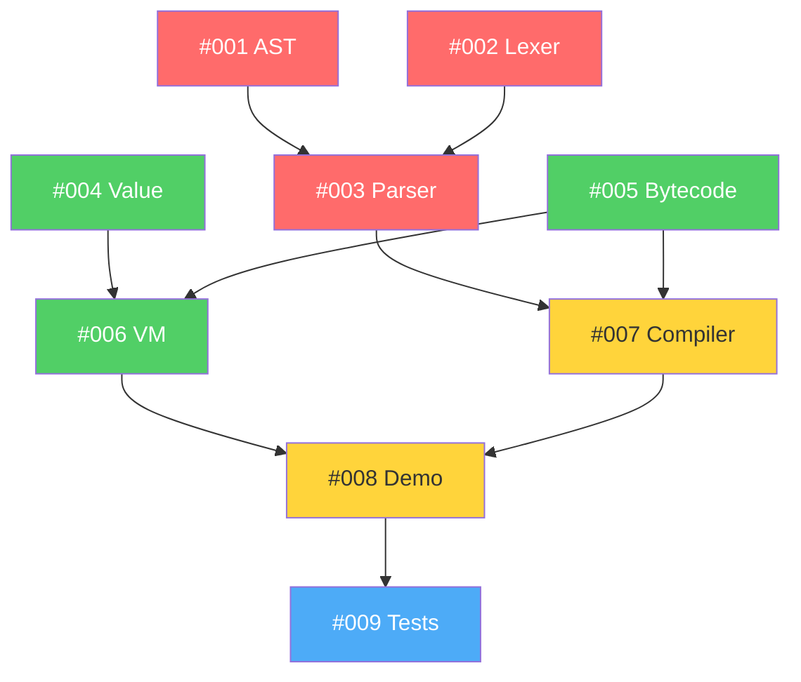

# FSRS Phase 1 MVP Workstreams

This directory contains all GitHub issues for Phase 1: MVP implementation (Weeks 1-3).

## 📋 Issue Organization

Issues are organized into parallel workstreams that can be worked on simultaneously:

```
docs/workstreams/phase-1-mvp/
├── README.md                     # This file
├── DEPENDENCIES.md               # Dependency graph
├── PARALLELIZATION.md            # Parallel work guide
├── 001-core-ast.md               # Core AST definitions
├── 002-lexer-tokenizer.md        # Lexer implementation
├── 003-parser.md                 # Parser implementation
├── 004-value-representation.md   # VM value types
├── 005-bytecode-instructions.md  # Bytecode and chunks
├── 006-vm-interpreter.md         # VM execution loop
├── 007-bytecode-compiler.md      # AST to bytecode
├── 008-demo-host.md              # Demo integration
└── 009-test-suite-ci.md          # Testing and CI
```

## 🎯 Phase 1 Goals

**Objective**: Prove the concept with a working Mini-F# interpreter that can execute simple scripts.

### Success Criteria
- ✅ Parse simple F# expressions (let, if/then/else, arithmetic)
- ✅ Compile AST to bytecode
- ✅ Execute bytecode in VM
- ✅ Run end-to-end examples
- ✅ 50+ unit tests passing
- ✅ CI/CD pipeline green

## 📊 Milestone Breakdown

| Milestone | Duration | Issues | Description |
|-----------|----------|--------|-------------|
| **1.1: Frontend Foundation** | Week 1 | #001-#003 | AST, lexer, parser |
| **1.2: VM Foundation** | Week 2 | #004-#006 | Values, bytecode, interpreter |
| **1.3: Integration** | Week 3 | #007-#009 | Compiler, demo, tests |

**Total**: 9 issues across 3 weeks

## 🔀 Parallelization Strategy

### Week 1: Frontend Foundation (3 parallel tracks)

**Group A - Core Structures**:
- #001: Core AST (2-3 days) - `fsrs-frontend/src/ast.rs`

**Group B - Lexical Analysis**:
- #002: Lexer/Tokenizer (2-3 days) - `fsrs-frontend/src/lexer.rs`

**Group C - Syntax Analysis**:
- #003: Parser (3-4 days) - `fsrs-frontend/src/parser.rs`
  - Can start after #001 (AST) is defined
  - Uses #002 (Lexer) for token stream

### Week 2: VM Foundation (3 parallel tracks)

**Group A - Value System**:
- #004: Value Representation (2-3 days) - `fsrs-vm/src/value.rs`

**Group B - Instruction Set**:
- #005: Bytecode Instructions (2-3 days) - `fsrs-vm/src/bytecode.rs`

**Group C - Execution Engine**:
- #006: VM Interpreter (3-4 days) - `fsrs-vm/src/vm.rs`
  - Can start after #004 and #005

### Week 3: Integration (sequential)

**Group D - Compilation**:
- #007: Bytecode Compiler (4-5 days)
  - Depends on: #001, #003, #005

**Group E - Demo & Testing**:
- #008: Demo Host (2-3 days) - Can work in parallel with #007
- #009: Test Suite & CI (ongoing, 2-3 days)

## 🏷️ Label System

### Type Labels
- `feature` - New feature implementation
- `infrastructure` - Build system, tooling
- `documentation` - Documentation updates

### Priority Labels
- `priority: critical` - Blocking, must complete first
- `priority: high` - Important for milestone
- `priority: medium` - Normal priority

### Status Labels
- `blocked` - Blocked by another issue
- `in-progress` - Currently being worked on
- `ready-for-review` - Awaiting code review

### Phase Labels
- `phase-1: mvp` - Phase 1 MVP work

### Component Labels
- `component: frontend` - Parser/compiler work
- `component: vm` - VM runtime work
- `component: demo` - Demo host
- `component: tests` - Testing infrastructure

### Effort Labels
- `effort: s` - 1-2 days
- `effort: m` - 2-4 days
- `effort: l` - 4-7 days

### Dependency Labels
- `parallel-safe` - Can work in parallel
- `foundational` - Others depend on this

## 🔗 Critical Path



## 📈 Team Assignment (3 Developers)

### Developer 1: Frontend Specialist
- **Week 1**: #001 → #003 (AST, then Parser)
- **Week 2**: #002 (Lexer, can start in Week 1)
- **Week 3**: #007 (Bytecode Compiler)
- **Skills**: Parser design, F# syntax, AST transformation

### Developer 2: VM Specialist
- **Week 1-2**: #004 → #005 → #006 (Value, Bytecode, VM)
- **Week 3**: #008 (Demo Host integration)
- **Skills**: VM design, bytecode execution, Rust performance

### Developer 3: Integration & Testing
- **Week 1**: Support #001 (AST review), start docs
- **Week 2**: Support #006 (VM review), prepare examples
- **Week 3**: #009 (Test Suite & CI), integration testing
- **Skills**: Testing, CI/CD, documentation, debugging

## 🚀 Getting Started

### Prerequisites
- Rust 1.70+
- Nushell 0.90+
- Just command runner
- GitHub CLI (`gh`)

### Workflow
1. Pick an issue from the "Ready" column
2. Create feature branch: `feat/issue-NNN-short-desc`
3. Implement with TDD (tests first!)
4. Open draft PR early
5. Request review when ready
6. Squash merge to main
7. Delete feature branch

### Branch Naming
```
feat/issue-001-core-ast
feat/issue-002-lexer
fix/issue-005-bytecode-bug
```

### Commit Message Format
```
feat(frontend): implement core AST definitions (#001)

- Add Literal, BinOp, Expr enums
- Support variables, literals, let-bindings
- Include basic pattern matching support
- Add comprehensive doc comments

Closes #001
```

## 📝 Development Guidelines

### Test-Driven Development (TDD)
1. **Red**: Write failing test first
2. **Green**: Implement minimum code to pass
3. **Refactor**: Clean up implementation
4. Repeat for each feature

### PR Requirements
- ✅ All tests pass (`just test`)
- ✅ Clippy clean (`just lint`)
- ✅ Formatted (`just fmt`)
- ✅ Documentation updated
- ✅ No merge conflicts with main

### Code Review Checklist
- [ ] Tests cover edge cases
- [ ] Error messages are clear
- [ ] Public APIs documented
- [ ] No performance regressions
- [ ] Follows Rust idioms

## 🔧 Common Commands

```bash
# Build
just build                # Build all crates
just build-crate fsrs-frontend
just build-crate fsrs-vm

# Test
just test                 # Run all tests
just test-crate fsrs-frontend
just test-coverage        # Coverage report

# Quality
just check                # fmt + lint + test
just fmt                  # Format code
just lint                 # Run clippy

# Development
just watch                # Auto-rebuild
just watch-test           # Auto-test
just demo                 # Run demo
```

## 📚 Resources

- **[ROADMAP.md](../../ROADMAP.md)** - Overall project roadmap
- **[SETUP.md](../../SETUP.md)** - Development environment setup
- **[CLAUDE_CODE_NOTES.md](../../CLAUDE_CODE_NOTES.md)** - Detailed implementation tasks
- **[02-language-spec.md](../../02-language-spec.md)** - Language specification
- **[03-vm-design.md](../../03-vm-design.md)** - VM architecture

## 🤝 Support

- **GitHub Issues**: Bug reports and feature requests
- **GitHub Discussions**: Q&A and general discussion
- **CLAUDE.md**: Claude Code workflow guidance

---

**Phase Duration**: 3 weeks
**Total Issues**: 9
**Parallel Capacity**: 3 simultaneous tracks
**Target Completion**: End of Week 3